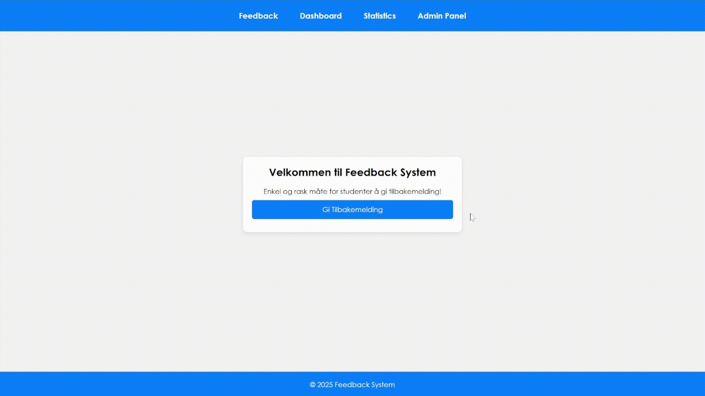

# Feedback skoleprosjekt! 📋💭

Et større prosjekt gjort av 6 stk. fra klassen, fjerde semester i DAT109. Man skal kunne skanne en QR-kode etter en forelesning (evt. ukentlig) som læreren viser på skjermen, og gi tilbakemelding på om det var bra, middels eller dårlig, samt med skriftlig tilbakemelding om ønskelig.

✅ Ferdig: Spring boot prosjekt satt opp. Frontend-design og nettsider satt opp med Thymeleaf struktur. Lenke mellom sider satt opp. Oppkobling til database og test for den er implementert og godkjent. Databasepassord er sikret.

❌ Uferdig: MVC og Java kode er ikke implementert. Database har ingen tabeller eller innhold. Logikk for login og registrer. Begynt på TomEE Plume server implementering, men ikke ferdig.
